# Log - volume recovery
Camille Piponiot  
`r Sys.Date()`  


# The data

## The TmFO network
The study is based on data from TmFO network . 
[describe]
In all plots all trees $\geq$~50~cm~DBH were identified, tagged and mapped. 
[table: measurements years per site]

### Volume per site {.tabset .tabset-pills } 


#### Braga Supay y Lobillo
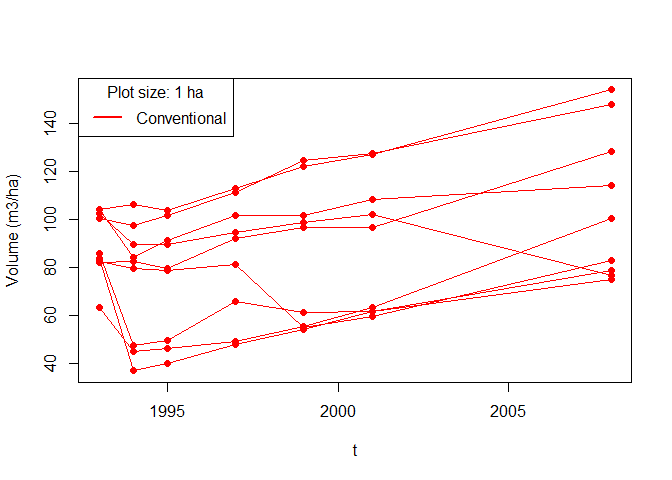<!-- -->

#### Chico Bocão
<!-- -->

#### Cumaru
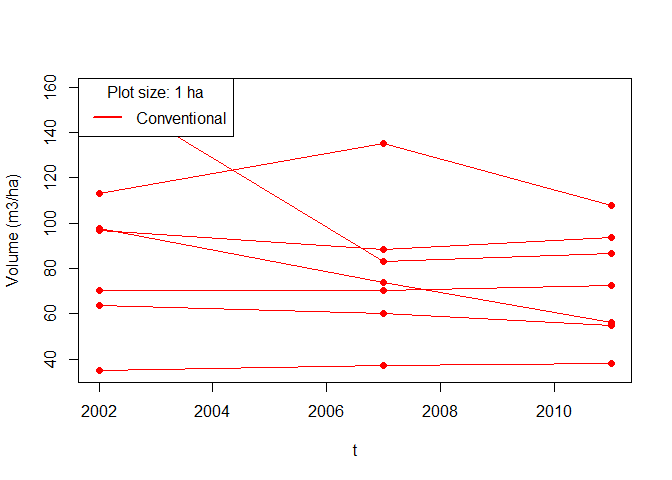<!-- -->

#### Ecosilva
<!-- -->

#### INPA
<!-- -->

#### Iracema
<!-- -->

#### Itacoatiara
<!-- -->

#### Jari
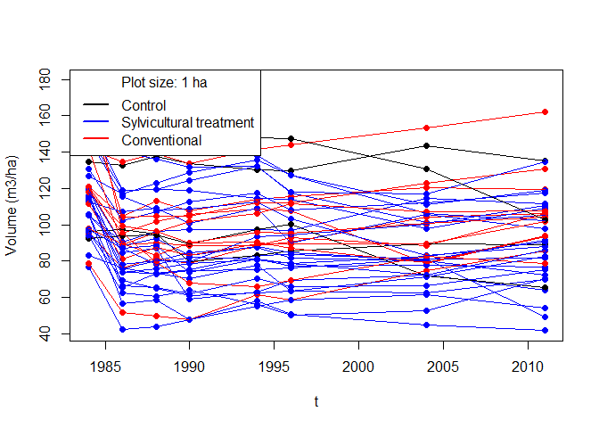<!-- -->


#### La Chonta
<!-- -->

#### Peteco
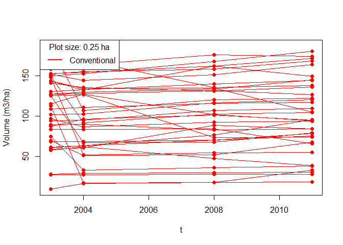<!-- -->

#### Paracou
<!-- -->

#### Paragominas
<!-- -->

#### Tabocal
<!-- -->

#### Tapajos
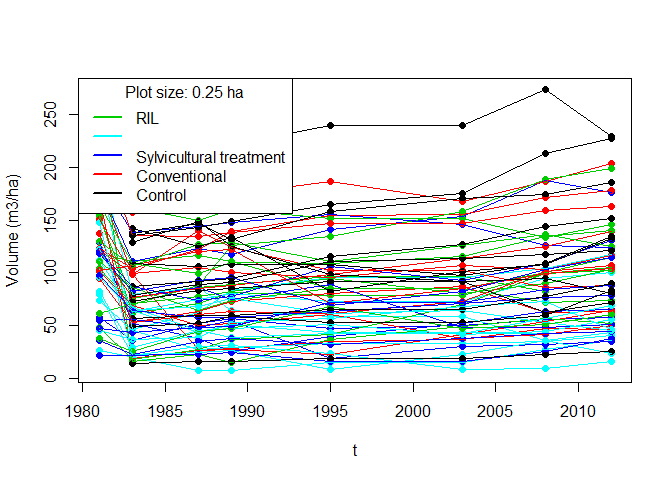<!-- -->


## RadamBrasil data

The RadamBrasil project was a big project carried one during the 1970 decade by the Brazilian government, in an attempt to map the potential resources of the Brazilian Amazon. Data was extracted at [IBGE website](ftp://geoftp.ibge.gov.br/informacoes_ambientais/vegetacao/vetores/escala_250_mil/amazonia_legal/). We used data from 2663 1~ha plots (with coordinates) where all trees above 100 cm of circumference were botanically identified and had their DBH measured and volume estimated.

## Volume allometry
Because we did not have a volume equation for all TmFO sites, we calibrated the following model with the RadamBrasil data:

$$ log(V_i) = a_p  + b\times log(DBH_i) $$
where $V_i$ ($m^3$) and $DBH_i$ ($cm$) are the volume and DBH of individual tree $i$, $a_p$ is the intercept for plot $p$, and $b$ is the slope (one for all plots).
The resulting parameters are $b\sim \mathcal{N}(2.174,0.006)$ and the results for parameters $(a_p)_{1\leq p\leq2663}$ are in Figure ...

<!-- -->

To model parameter $a_p$ in the allometric equation we used a radom forest algorithm, with the following environmental predictors:

* soil : bulk density, propotion of sand, prportion of coarse fragments, cation exchange capacity, soil total depth (m). All soil predictors were extracted from the [SoilGrids database](https://www.soilgrids.org/) at a 1 km resultion, at a depth of 100 cm (except for soil depth).

* climate: annual precipitation, precipitation seasonality, and solar radiation were extracted from the WorldClim 2.0 database at a resolution of 1~km.

$a_s$ values were then predicted for each TmFO site $s$ with the results of the Random Forest model.

The volume of each individual tree is then computed as:
$$ V_{i,k,p,s} = a_s\times (DBH_{i,k,p,s})^b$$
where $V_{i,k,p,s}$ and $DBH_{i,k,p,s}$ are the volume and DBH of individual $i$ at time $k$ on plot $p$ in site $s$.


## Volume computation
The total volume at each site $s$, plot $p$ and census $k$ was computed as:
$$ V_{k,p,s} = \sum_{i \in I_{k,p,s}} V_{i,k,p,s} \times (Surf_p)^{-1}$$
where $I_{p,k}$ is the set of live trees $\geq$50~cm~DBH in plot $p$ (of area $Surf_p$) at census $k$ and $V_{i,k,p,s}$ is the volume of the tree $i$ at census $k$.

Annual volume gain $\Delta Vg_{k,p,s}$ and annual volume loss $\Delta Vl_{k,p,s}$ ($m^3ha^{-1}yr^{-1}$) were computed as:
$$
\forall k\geq  2, \left\{ \begin{split}
      					  & \Delta Vg_{k,p,s} = \sum_{i\in I_{k,p,s}} \left( V_{i,k,p,s} - V_{i,k-1,p,s} \right) \times (Surf_p)^{-1}\\
						  & \Delta Vl_{k,p,s} = \sum_{i\in I_{k-1,p,s} \cap \overline{I_{k,p,s}}} \left( V_{i,k,p,s} - V_{i,k-1,p,s} \right) \times (Surf_p)^{-1}
    \end{split}
\right.
$$
where $I_{k,p,s}$ is the set of live trees $\geq$50~cm~DBH in plot $p$ at census $k$ and $I_{k-1,p,s} \cap \overline{I_{k,p,s}}$ is the set of trees that died between censuses $k-1$ and $k$ in plot $p$ in site $s$. If one tree $i \in I_{k,p,s}$ was $<$50~cm~DBH at census $k-1$, then $V_{i,k-1,p,s}=0 $.


# The model

## In the absence of disturbance
The model presented here links the fluxes, integrated over time, with the corresponding stocks (here the timber volume). Let us consider the theoretical case where the forest recovers from scratch and is not subject to any disturbance. Let $t$ be the maturity of the stand, in years: $V(t=0)=0$ and $\forall t>0, V(t)>0$, with $V(t)$ the total volume of the stand at maturity $t$. The total volume change is

$$
\frac{dV(t)}{dt}= \frac{dVg(t)}{dt}-\frac{dVl(t)}{dt}
$$

The volume gain from growth $\frac{dVg(t)}{dt}$ is the stand annual volume productivity. By analogy with well-studied carbon dynamics \cite{Malhi2012}, we consider this net volume productivity to be the difference of gross volume productivity $GVP(t)$ and the volume loss due to respiration $VR(t)$.

The gross volume productivity $GVP$ increases with stand maturity until reaching a finite limit, the ecosystem maximum gross productivity:
$$
GVP(t) = \alpha_G\times (1-e^{-\beta_G\times t})
$$
where $\alpha_G$ is the finite limit and $\beta_G$ the rate at which it is reached.

The respiration $VR$, i.e the energy cost of maintenance, is proportional to the total volume:
$$
VR(t) = \theta\times V(t)
$$
where $\theta$ is a constant.

Defining the net volume productivity as the difference of $GVP(t)$, assumed to increase but decelerate with forest maturity, and $VR(t)$, assumed to linearly increase with total volume, allows a hump-shaped net productivity curve (Fig....), similar to previous results on carbon dynamics [@Chen2002,@He2012].\\


We expect the annual volume loss by mortality to reach a finite limit $\alpha_M$ at a rate $\beta_M$. We thus have:
$$
\forall t\in[0,t_ {ini}], \left\{ \begin{split}
         & \frac{dVg(t)}{dt} = GVP(t) - VR(t) =  \alpha_G \times\left(1-e^{-\beta_G t}\right) - \theta\times V(t)\\
		 & \frac{dVl(t)}{dt} = \alpha_M \times \left(1-e^{-\beta_M t}\right)\\
		 & \frac{dV(t)}{dt} = \frac{dVg(t)}{dt} - \frac{dVl(t)}{dt}
    \end{split}
\right.
$$

We get the non-homogeneous differential equation of first order:
$$
\left\{ \begin{split}
         & \frac{dV(t)}{dt} = \alpha_G \times\left(1-e^{-\beta_G t} \right) - \theta \times V(t) - \alpha_M \times \left(1-e^{-\beta_M t}\right) \\
		 & \text{with } V(0) = 0
		\end{split}
\right.
$$

The solution of this equation is:

$$
\label{eq:vol}
V(t) = \frac{\alpha_G}{\theta}\Big( 1- \frac{\theta\times e^{-\beta_G t} - \beta_G\times e^{-\theta t} }{\theta - \beta_G}\Big) - \frac{\alpha_M}{\theta}\Big( 1- \frac{\theta\times e^{-\beta_M t} - \beta_M\times e^{-\theta t} }{\theta - \beta_M} \Big)
$$
To have $V(t)>0$, we must have $\beta_G > \beta_M$.

We thus have the following equations:
$$
\left\{ \begin{split}
         & \frac{dVg(t)}{dt} = \frac{\alpha_G\times\beta_G}{\theta-\beta_G} \Big(e^{-\beta_G t} - e^{-\theta t} \Big) + \alpha_M \Big( 1- \frac{\theta\times e^{-\beta_M t} - \beta_M\times e^{-\theta t} }{\theta - \beta_M} \Big) \\
		& \frac{dVl(t)}{dt} = \alpha_M \times (1-e^{-\beta_M t })
		\end{split}
\right.
$$

The volume potential of the forest stand (i.e. the volume of an infinitely-mature stand) is:
$$
vmax = \lim_{\infty} (V) = \frac{\alpha_G - \alpha_M}{\theta}
$$


## Hypothesis

Initial stand maturity ($ti$), maximum primary productivity ($\alpha_G$) and maximum volume ($vmax$) vary among sites; other parameters have only one value for all TmFO. 


## Parameters prior and justification

# Inference


# Trying the model without covariates

## Stan Inference {.tabset .tabset-pills #aP }


### $\beta_G$, $\beta_M$, $\theta$
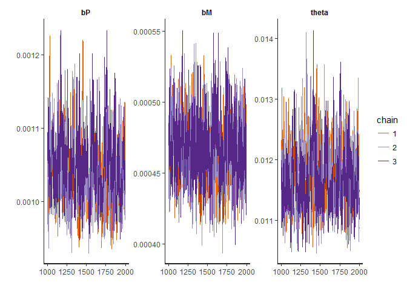<!-- -->

### $\alpha_G$
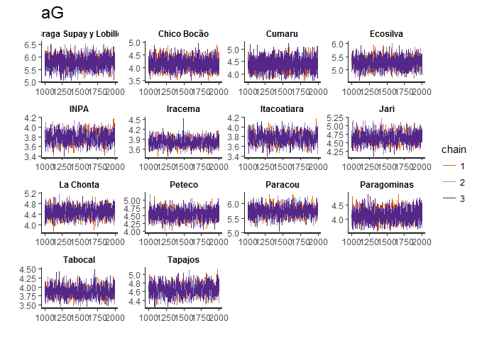<!-- -->

### $vmax$
<!-- -->


### $ti$
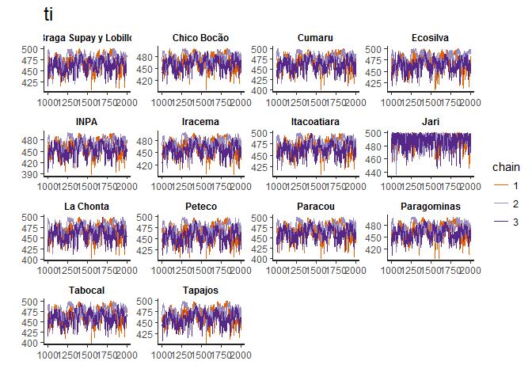<!-- -->

### $\sigma_V$, $\sigma_G$, 
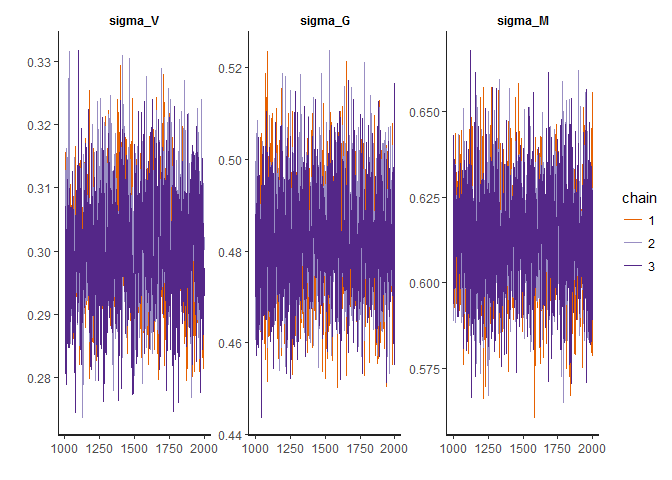<!-- -->

### $tlog$

```
## ci_level: 0.8 (80% intervals)
```

```
## outer_level: 0.95 (95% intervals)
```

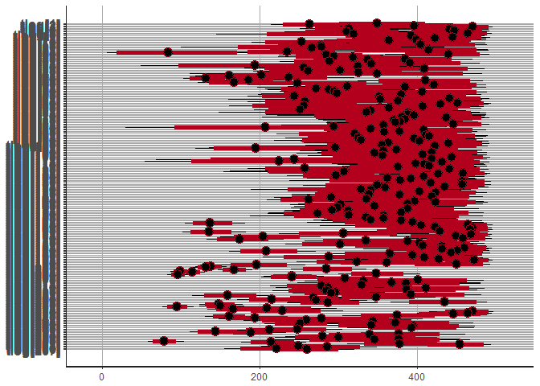<!-- -->


## Goodness of prediction {.tabset .tabset-pills #tiS }


### Braga Supay y Lobillo

<!-- -->

### Chico Bocão

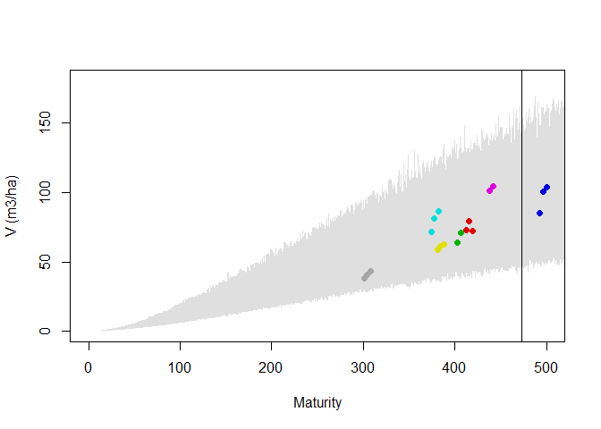<!-- -->

### Cumaru

<!-- -->

### Ecosilva

<!-- -->

### INPA

<!-- -->

### Iracema

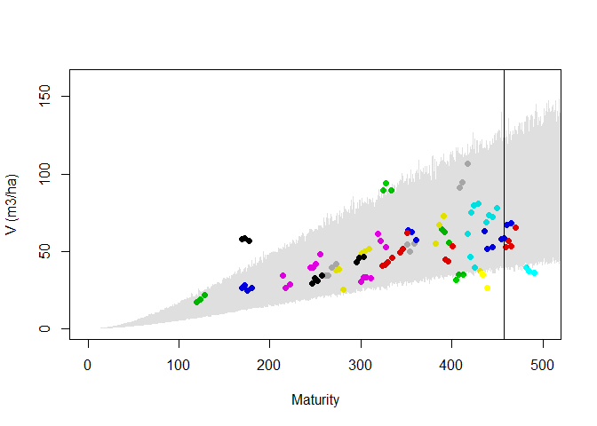<!-- -->

### Itacoatiara

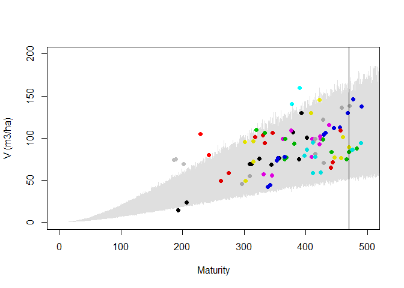<!-- -->

### Jari

<!-- -->

### La Chonta

<!-- -->

### Peteco

<!-- -->

### Paracou

<!-- -->

Maturity predictions look strange... Not at all what I got with the first study!
<!-- -->

### Paragominas

<!-- -->

### Tabocal

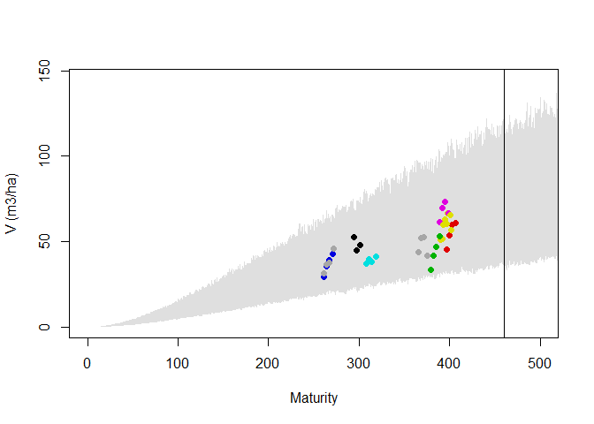<!-- -->

### Tapajos

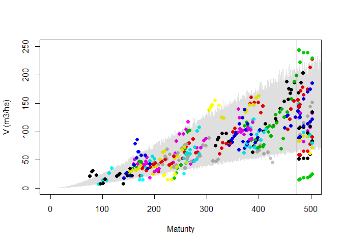<!-- -->

# Testing the effect of covariates

## Correlation between parameters value and covariates
For now, we will use the parameters maximum likelihood value from the model where Initial stand maturity ($ti$), maximum primary productivity ($\alpha_G$) and maximum
volume ($vmax$) vary among plots, but $ti$ does not vary from plot to plot.

<!-- -->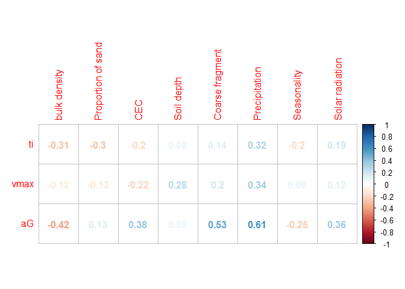<!-- -->

# Tests 

### Grouping by site and treatment for plots < 5 ha


# Trying the model without covariates

## Stan Inference {.tabset .tabset-pills #aP }

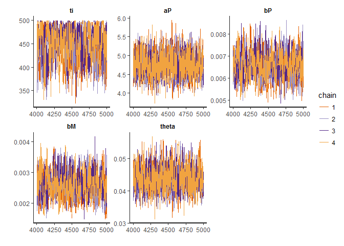<!-- -->

### vmax

<!-- -->

## Paracou predictions

<!-- -->

